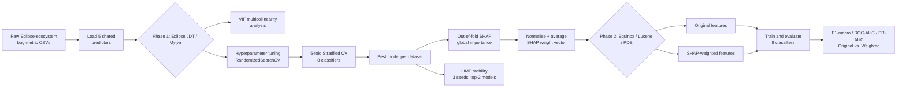

# Explainable_AI
┌──────────────────────────┐          ┌──────────────────────────────┐
│   Eclipse JDT + Mylyn     │          │  Equinox · Lucene · Eclipse PDE│
│                           │          │        (NO labels used)        │
│  1. 5-fold CV, 8 models   │   SHAP   │                                 │
│  2. Tune hyperparameters  │  weight  │  4. Multiply each feature      │
│  3. Best model → SHAP     │ ───────► │     column by its SHAP weight  │
│     (out-of-fold, no      │  vector  │  5. Train/evaluate original    │
│     test-set leakage)     │          │     vs. SHAP-weighted          │
└──────────────────────────┘          └──────────────────────────────┘
```

The transformation itself is deliberately simple — **multiply each feature column by its normalised mean-absolute SHAP value** — because the point isn't a fancy transfer-learning architecture, it's testing whether *the explanation itself* carries transferable signal.

---

## 🏗️ Pipeline Architecture



---

## 📊 Datasets

Sourced from **D'Ambros et al.'s Eclipse bug-prediction benchmark** ([bug.inf.usi.ch](https://bug.inf.usi.ch/download.php)) — class-level metrics for five real Eclipse-ecosystem Java projects.

| Dataset | Phase | Instances | Features | Buggy | Clean | Imbalance Ratio |
|---|:---:|:---:|:---:|:---:|:---:|:---:|
| Eclipse JDT | 1 (source) | 997 | 5 | 206 | 791 | 3.84 |
| Mylyn | 1 (source) | 1,862 | 5 | 620 | 1,242 | 2.00 |
| **Equinox** | 2 (target) | 324 | 5 | 129 | 195 | 1.51 |
| **Lucene** | 2 (target) | 691 | 5 | 64 | 627 | 9.80 |
| **Eclipse PDE** | 2 (target) | 1,497 | 5 | 209 | 1,288 | 6.16 |

**The 5 shared predictors** (all cumulative bug-history counts): `NBFU`, `NNTBFU`, `NMBFU`, `NCBFU`, `NHPBFU`. Columns that are arithmetic functions of the label (`nonTrivialBugs`, `majorBugs`, etc.) are dropped before modelling to prevent trivial leakage.

---

## 🧪 Methodology

| Step | What happens |
|---|---|
| **Preprocessing** | Pipeline A (tree models): identity — splits are scale-invariant. Pipeline B (linear/distance models): `log1p` → `RobustScaler` → conditional `SMOTE` (only when fold imbalance ratio > 2.0). |
| **VIF analysis** | Confirms severe multicollinearity (VIF > 150) in the two cumulative bug-count features — expected, since they're running sums over shared history. Retained anyway, since interpretability of *all five* features is the object of study. |
| **Hyperparameter tuning** | `RandomizedSearchCV` (3-fold, `f1_macro`) per classifier per dataset — replaces the paper's fixed defaults to squeeze out real improvements. |
| **Classifiers (×8)** | RandomForest, XGBoost, LightGBM, GradientBoosting, ExtraTrees, LogisticRegression, SVC (RBF), KNN. |
| **SHAP weighting** | Computed **out-of-fold** across a 5-fold CV split of the Phase-1 training data — the weight vector never sees a held-out test label, closing the leakage gap that a test-split computation would introduce. |
| **LIME stability** | Top-2 Phase-1 models explained with `LimeTabularExplainer` across 3 random seeds; mean per-feature weight std (σ̄) quantifies how consistent the local explanation is. |
| **Cross-project evaluation** | Each Phase-2 project is evaluated **twice** — original features vs. SHAP-weighted features — under an identical 80/20 stratified split, and the deltas (ΔF1, ΔAUC, ΔPR-AUC) are reported per classifier. |

---

## 📈 Results

### Phase 1 — In-project performance (5-fold CV, tuned)

| Dataset | Best Model | F1-macro | ROC-AUC | PR-AUC |
|---|---|:---:|:---:|:---:|
| Eclipse JDT | **ExtraTrees** | 0.728 ± 0.033 | 0.792 ± 0.033 | 0.623 ± 0.042 |
| Mylyn | **ExtraTrees** | 0.635 ± 0.025 | 0.732 ± 0.004 | 0.351 ± 0.060 |

### SHAP feature weights (out-of-fold, leakage-free)

| Feature | Weight | Meaning |
|---|:---:|---|
| `NBFU` | **0.279** | Total bugs found until release — dominant signal |
| `NNTBFU` | 0.270 | Non-trivial bugs found until release |
| `NHPBFU` | 0.198 | High-priority bugs found until release |
| `NMBFU` | 0.168 | Major bugs found until release |
| `NCBFU` | 0.085 | Critical bugs found until release — smallest weight |

### Phase 2 — Cross-project: original vs. SHAP-weighted

| Target | Best-improved model | ΔF1-macro | ΔROC-AUC | ΔPR-AUC | Tree models |
|---|---|:---:|:---:|:---:|---|
| **Equinox** | GradientBoosting | **+1.75%** | +0.30% | +0.24% | ≈0 change |
| **Lucene** *(high imbalance)* | SVC | 0.0% F1 | **+3.48%** | −0.64% | ≈0 change |
| **Eclipse PDE** *(high imbalance)* | SVC / LogisticRegression | **+2.68% / +2.64%** | mixed | mixed | ≈0 change |

> 🌳 **Why tree models barely move:** a decision tree picks split thresholds by *comparing raw feature values*. Multiplying a column by a positive constant is a monotone rescaling — it cannot change which threshold wins. SVC and LogisticRegression *do* move, because their margins/gradients depend on Euclidean distance and feature magnitude, which scaling directly affects. This is the mechanical reason the weighting helps linear/margin classifiers and does nothing for ensembles of trees.

### Comparison with published results

| Method | Dataset | Best AUC | Notes |
|---|---|:---:|---|
| D'Ambros et al. (original authors) | Eclipse JDT | 0.720 | — |
| D'Ambros et al. (original authors) | Mylyn | 0.710 | — |
| Zhao et al. | Eclipse sub-projects | 0.74–0.76 | Feature selection + ensemble |
| Al-Smadi et al. | Eclipse-type | 0.730 | Post-hoc SHAP, no cross-project |
| **This work (tuned)** | Eclipse JDT (P1) | **0.792** | In-project, 5-fold CV |
| **This work (tuned)** | Mylyn (P1) | **0.732** | In-project, 5-fold CV |
| **This work (SHAP-wgt, tuned)** | Lucene (P2) | **0.791** | Cross-project, **no target labels** |
| **This work (SHAP-wgt, tuned)** | PDE (P2) | **0.797** | Cross-project, **no target labels** |

### LIME stability (RQ2)

| Dataset | Model | σ̄ (lower = more stable) |
|---|---|:---:|
| Eclipse JDT | ExtraTrees | **0.00002** |
| Eclipse JDT | RandomForest | 0.00017 |
| Mylyn | ExtraTrees | **0.00011** |
| Mylyn | KNN | 0.00152 |

Tree-ensemble explanations are dramatically more stable across random seeds than distance-based ones — axis-aligned splits mean small perturbations tend to land in the same region of feature space.

---

## 🗂️ Repository Structure

```
Explainable_AI/
├── data/                        # Raw bug-metric CSVs (5 Eclipse-ecosystem projects)
├── pipeline.py                  # ⭐ Main entry point — full Phase-1 + Phase-2 pipeline
├── outputs/                     # Generated tables, plots, tuned params, SHAP/LIME artifacts
│   ├── phase1_cv_*.csv          # In-project 5-fold CV results
│   ├── phase2_*.csv             # Cross-project original-vs-weighted results
│   ├── shap_weights.csv         # Final averaged SHAP weight vector
│   ├── lime_stability.csv       # RQ2 stability metric
│   ├── lime_instances_*.json    # Confidently-buggy/clean/borderline explanations
│   ├── vif_table.csv            # Multicollinearity analysis
│   ├── tuned_params_*.csv       # Hyperparameter search results per dataset
│   ├── table12_comparison.csv   # Comparison with published state of the art
│   └── models/                  # Serialized trained models
├── src/                         # Earlier standalone preprocessing/modeling modules
├── *.ipynb                      # Exploratory analysis notebooks (per-dataset deep dives)
├── main.tex / references.bib    # Paper source (LaTeX)
└── xai.docx / xai.pdf           # Paper manuscript
```

---

## 🚀 Getting Started

### Prerequisites
- Python 3.10+
- pip

### Installation
```bash
git clone https://github.com/officialpk956-wq/Explainable_AI.git
cd Explainable_AI
pip install pandas numpy scipy scikit-learn xgboost lightgbm shap lime imbalanced-learn
```

### Run the full pipeline
```bash
python pipeline.py
```

This runs VIF analysis → hyperparameter tuning → Phase-1 CV → LIME stability → out-of-fold SHAP → Phase-2 evaluation → Table 12 comparison, and writes every result as a CSV/JSON into `outputs/`. A full run takes a few minutes on a modern laptop.

---

## 🔁 Reproducing the Results

All randomness is seeded (`SEED = 42`) for reproducibility:
- 80/20 stratified train/test split
- 5-fold stratified CV
- 3-fold CV inside hyperparameter search
- LIME stability uses 3 explicit seeds: `{42, 123, 999}`

A built-in sanity check runs automatically at the end of `pipeline.py` and asserts:
1. SHAP weights sum to 1 and are non-negative (Eq. 3–4 of the paper).
2. Tree-model F1 barely moves under SHAP weighting (monotone scaling can't change split thresholds — a small tolerance accounts for float boundary effects).

---

## ⚠️ Limitations & Threats to Validity

- **One ecosystem.** All five datasets come from Eclipse-family projects sharing the same feature schema. Transfer to a different ecosystem (Apache, JS repos) is untested.
- **One source combination.** SHAP weights always come from Eclipse JDT + Mylyn together — a different source pair might produce different weights.
- **Small effect sizes.** The largest gain is ~+3.5% on one metric — real, cheap to apply, but not decisive on its own for a deployment decision.
- **F1-macro on high-imbalance data.** For Lucene (IR = 9.80) and PDE (IR = 6.16), **PR-AUC is the more informative primary metric** — the pipeline flags this explicitly in its output (`primary_metric` column).
- **σ̄ measures explanation consistency, not correctness.** A low LIME variance means the explanation is *stable* across seeds, not that it's *faithful* to the model.

---

## 🗺️ Roadmap

- [x] Fix SHAP leakage via out-of-fold computation
- [x] Add hyperparameter tuning per classifier/dataset
- [x] VIF multicollinearity analysis
- [x] 3-instance LIME explanations (buggy / clean / borderline)
- [ ] Test ecosystem transfer beyond Eclipse (Apache, GitHub JS repos)
- [ ] Dynamic weighting as target-project labels trickle in (active learning)
- [ ] SHAP-guided attention mechanism as a deep-learning alternative to multiplicative scaling

---

## 📄 Citation

If you use this work, please cite the accompanying paper:

```bibtex
@article{kumar2026sdp,
  title   = {Enhancing Software Defect Prediction Using Explainable AI and Cross-Project Feature Weighting},
  author  = {Kumar, Priyanshu and Rajnish, Kumar and Kumar, Shubham},
  year    = {2026},
  note    = {Birla Institute of Technology, Mesra}
}
```

Dataset citation:
> D'Ambros, M., Lanza, M., & Robbes, R. (2012). Evaluating defect prediction approaches: A benchmark and an extensive comparison. *Empirical Software Engineering*, 17(4), 531–577.

---

## 👥 Authors

**Priyanshu Kumar** · **Kumar Rajnish** · **Shubham Kumar**
Birla Institute of Technology, Mesra, Ranchi, India
*All authors contributed equally.*

📧 Corresponding author: `btech10945.23@bitmesra.ac.in`

---

<p align="center"><i>Explainability outputs can be active ingredients, not just annotations.</i></p>
